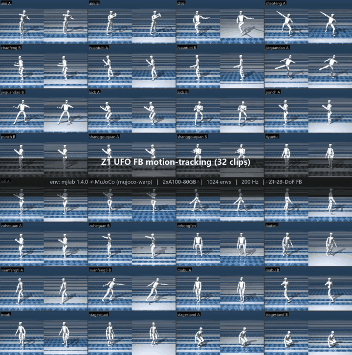

# Magicbot Z1 UFO：23-DoF FB 运动先验

本仓库是基于 RoboParty Lab UFO 框架扩展的 Magicbot Z1 工作流。当前重点是
Z1 23-DoF Forward-Backward（FB）训练、运动先验评估、ONNX 导出，以及用于
检查 44 个学习到的运动先验的本地 MuJoCo 滑条工具。

<p align="center">
  <a href="README.md">English</a> | <a href="README_zh-CN.md">中文</a>
</p>

<p align="center">
  
</p>

## 先看结果

上面的动图展示了一个 Z1 FB policy 对 clean Z1 motion set 中 32 个标注片段的
跟踪结果。这个 policy 学到的是 latent-conditioned motion prior：不是为每个
技能手写一个任务 reward，而是训练一个由 latent 向量 `z` 条件化的统一 actor。
推理时，参考动作会被 backward encoder 编码成一段 `z` 轨迹，actor 再在仿真中
跟随这段动作。

本地交互式查看工具是：

```powershell
.venv\Scripts\python.exe tools\z1\ufo_44_slider_tk_mujoco.py `
  --artifact-dir ..\checkpoints\Z1_UFO\compare_hand_vs_nohand\fakehand_32M
```

滑条可以选择 motion index `0..43`；Left/Right 微调一个动作，`R` 重置，
Space 暂停，`Q` 退出。

## 从先验到结果

Z1 的结果来自一组整理后的运动先验，而不是手写任务控制器。

| 阶段 | 本地约定 | 产物 |
| --- | --- | --- |
| 机器人定义 | `configs/robots/z1_23dof.yaml` 和 Z1 MJCF assets | 23-DoF 关节顺序、PD gains、limits、action scale |
| 运动先验 | `configs/data/z1_mimic_clean.yaml` | 44 个整理后的 RobotState clips |
| FB 训练 | `run_train.sh --agent fb --robot-config configs/robots/z1_23dof.yaml` | rolling checkpoint 和评估指标 |
| Tracking inference | `humanoidverse.tracking_inference` | MP4、`zs_*.pkl`、ONNX policy、`.meta.json` |
| 本地 sim-to-sim | `tools/z1/deploy_onnx_mujoco.py` | 使用导出 policy 的 plain MuJoCo rollout |
| 交互式先验浏览器 | `tools/z1/ufo_44_slider_tk_mujoco.py` | 基于 44 条 latent trajectories 的 Tkinter 滑条 |

44-motion slider 会加载四组缓存 motion：

```text
cache/motion_data/z1_mimic_clean/z1_cyclic_locomotion_train_near10s_ufo.pkl
cache/motion_data/z1_mimic_clean/z1_atomic_skills_train_near10s_ufo.pkl
cache/motion_data/z1_mimic_clean/z1_acrobatics_recovery_train_near10s_ufo.pkl
cache/motion_data/z1_mimic_clean/z1_pose_low_motion_train_near10s_ufo.pkl
```

启动 slider 前先生成匹配的 latent cache：

```powershell
$env:MUJOCO_GL = "glfw"
$env:PYTHONUTF8 = "1"

.venv\Scripts\python.exe tools\z1\generate_z1_44_latents.py `
  --model-folder ..\checkpoints\Z1_UFO\z1_mimic_clean_fb_2xa100_1024env_20260716_044447 `
  --artifact-dir ..\checkpoints\Z1_UFO\compare_hand_vs_nohand\fakehand_32M `
  --device cpu
```

## Z1 产物约定

大 checkpoint、ONNX、视频、latent cache、motion cache 不放进 Git。它们应放在
仓库父目录的 checkpoint 布局中：

```text
../checkpoints/Z1_UFO/
```

公开的 Z1 dataset/checkpoint mirror：

```text
https://huggingface.co/datasets/PhangHongHao/UFO-Z1
```

下载当前最好的 Z1 FB checkpoint：

```bash
hf download PhangHongHao/UFO-Z1 \
  --repo-type dataset \
  --local-dir ../checkpoints/Z1_UFO \
  z1_mimic_clean_fb_2xa100_1024env_20260716_044447/best_so_far.safetensors
```

如果要做 desktop deployment-style 可视化，需要提供匹配的 ONNX policy 和同目录
`.meta.json`，例如：

```text
../checkpoints/Z1_UFO/compare_hand_vs_nohand/fakehand_32M
```

当前 Z1 ONNX actor 是机器人专属的：

```text
input:  actor_obs [batch, 631]
output: action    [batch, 23]
```

输入向量是：

```text
actor_obs = state[52] + last_action[23] + history_actor[300] + z[256]
```

ONNX 旁边的 `.meta.json` 是关节顺序和维度的权威约定。不要把这个 policy 直接
用于其他机器人，或用于不同 Z1 action layout；这些情况需要重新导出匹配的
checkpoint。

## 框架路径

Z1 pipeline 的路径是：

```text
RobotState clips
  -> Z1 robot config + data manifest
  -> MJLab / MuJoCo-Warp vectorized training
  -> FBcprAuxAgent / FBcprAuxModel
  -> checkpoint + tracking evaluation
  -> backward encoder z trajectories
  -> ONNX actor export
  -> plain MuJoCo deploy and Tkinter slider tools
```

本地详细文档：

- [Z1 ONNX Deploy Notes](tools/z1/README.md)
- [Z1 framework diagram](docs/diagrams/bfm_z1_training_framework.svg)
- [Z1 ONNX sim-to-sim notes](docs/z1_onnx_sim2sim_deploy_notes.md)
- [Z1 mimic semantic groups](docs/z1_mimic_semantic_groups.md)

## 运行基础项目

本工作流仍使用上游 UFO 的包结构和命令。

安装：

```bash
uv sync
```

常用检查：

```bash
uv run ruff check .
uv run python -m compileall -q humanoidverse tests
uv run python tests/test_motion_data_adapter.py
```

Z1 smoke training：

```bash
./run_train.sh \
  --agent fb \
  --robot-config configs/robots/z1_23dof.yaml \
  --data-manifest configs/data/z1_mimic_clean.yaml \
  --gpu-ids single \
  --smoke \
  --work-dir /tmp/ufo_smoke_z1
```

## 致谢与上游项目

本仓库直接基于 RoboParty Lab 的 UFO 项目扩展。使用本代码库时，请同时引用并
链接原项目：

- 上游仓库：<https://github.com/Roboparty/UFO>
- 项目主页：<https://roboparty.github.io/UFO/>
- 论文 PDF：<https://roboparty.github.io/UFO/assets/UFO.pdf>
- Deploy branch：<https://github.com/Roboparty/UFO/tree/deploy>

原始 UFO 项目是面向人形机器人控制的无监督强化学习框架。其 `main` 分支提供
MJLab 训练、RobotState 导入、tracking/goal/reward inference 和 ONNX 导出。
上游最完整的路径是 Unitree G1；本仓库在此基础上扩展 Magicbot Z1 实验。

```bibtex
@misc{ufo2026,
  author       = {{RoboParty Lab Team}},
  title        = {UFO: An Unsupervised Reinforcement Learning Framework for Humanoid Control},
  year         = {2026},
  howpublished = {\url{https://github.com/Roboparty/UFO}},
  note         = {Project page: \url{https://roboparty.github.io/UFO/}}
}
```

License: see [LICENSE](LICENSE).
